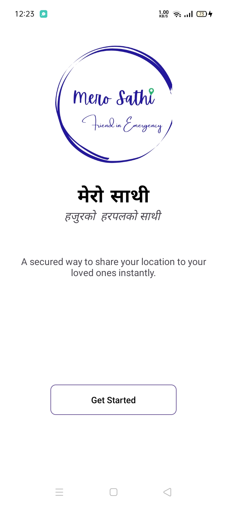
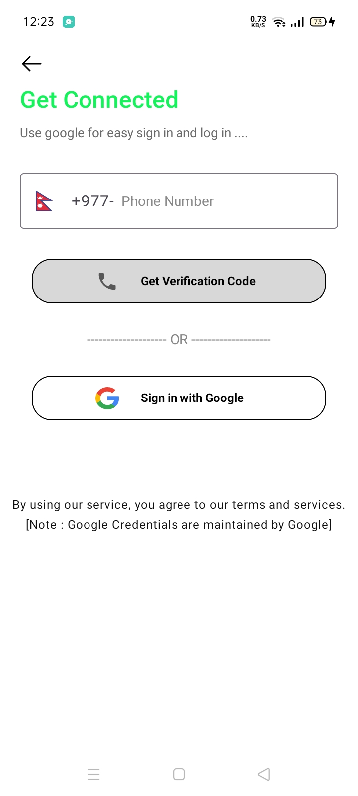
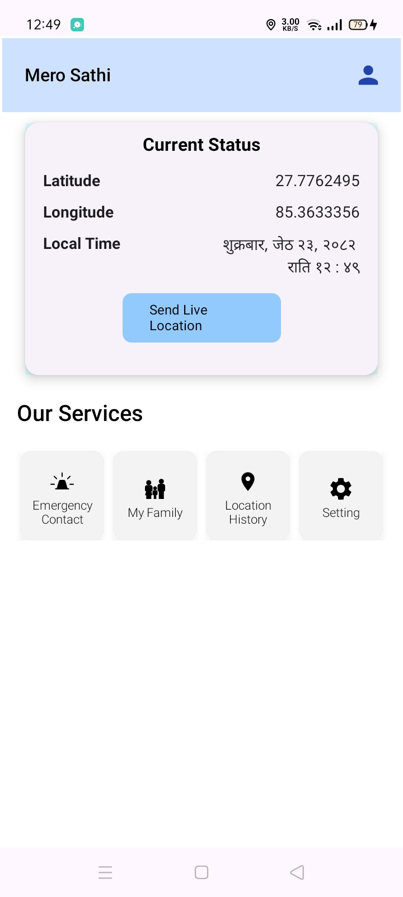
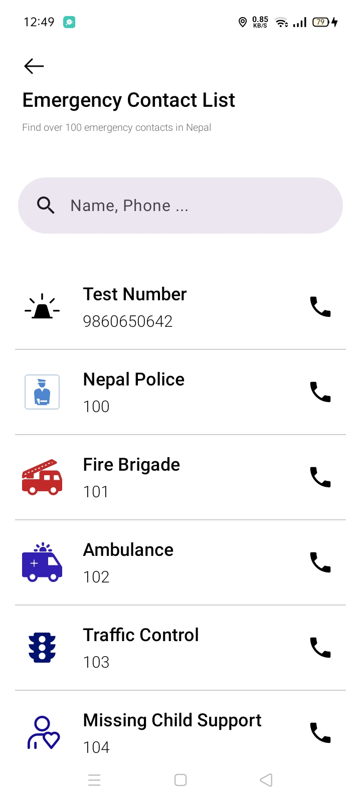
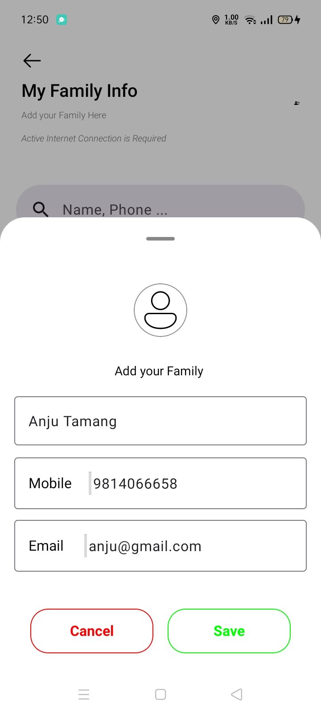
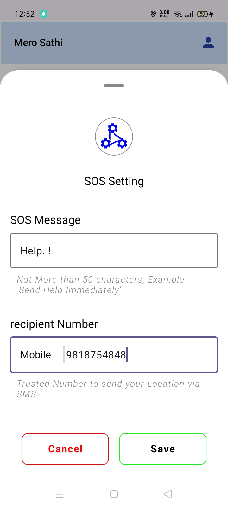
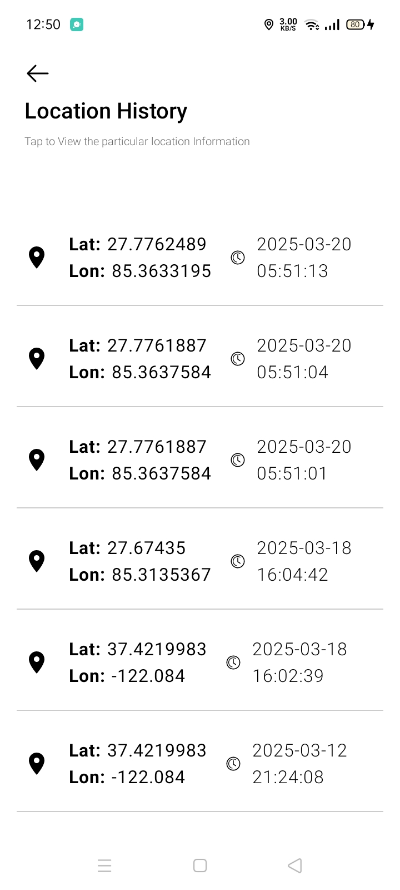
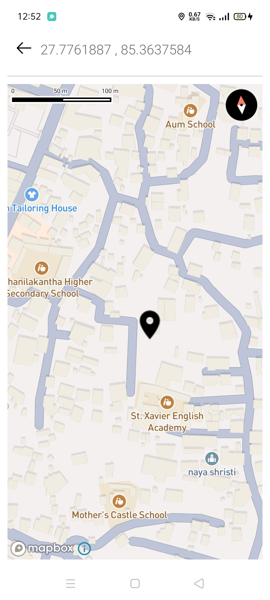

# Mero Sathi 🚨📍

**Mero Sathi** is an Android application built to enhance personal safety by enabling real-time emergency communication and location tracking. It is especially tailored for users in Nepal, integrating local emergency numbers and custom SOS features.

Mero Sathi allows you to share your real time location to your preferred familly memeber directly to their message box and without needing the **Internet Connection**

---

## 🚀 Features

- 🔐 **Secure Login**  
  Login using Google Sign-In or phone number authentication for quick and secure access.

- ☎️ **Nepal Emergency Numbers**  
  Access a list of important emergency contact numbers in Nepal and call them directly from the app.

- 📍 **Real-Time Location Tracking**  
  Tracks user's live location and allows sending location data via SMS in emergency scenarios.

- 👨‍👩‍👧 **Family Management**  
  Add or remove family members who will receive your emergency alerts.

- ✉️ **Custom SOS Message**  
  Set a personalized SOS message to be sent during emergencies. Also, you can select the receipient who will receive your SOS message.

- 🕒 **Location Request History**  
  View a list of recent location requests and alerts sent or received.

- 🗺️ **Map View Integration**  
  Visualize your or a family member’s location using [Mapbox Maps](https://www.mapbox.com/).

---

## 📦 Tech Stack

- **Kotlin + Jetpack Compose**
- **Firebase Authentication**
- **Mapbox SDK**
- **SMS Manager & Telephony**
- **Firestore Database**

---

## ⚠️ Disclaimer

This APK is shared for **testing purposes only**. Do not redistribute without permission.

## 📱 Installation
1. Download the latest apk from the APK Release
2. Allow installation from unknown sources 
3. Install the Application:
    
    Open the downloaded APK file and follow the prompts to install the app.

4. Use Following credentials for Phone number Authentication

        > Phone Number  => 9860650642

        > One Time Password (OTP) => 650642

5. Start Using the Application

--- 
## 📥 Download APK

🔗 [Download Latest APK](https://github.com/Mahato-Sunil/mero-sathi-apk/releases/tag/v1.0.0-alpha)

## 📃License and Usages 

Copyright (c) 2025 Sunil Mahato

All rights reserved.

This APK is provided for personal testing and evaluation purposes only. 
Redistribution, reverse engineering, modification, or commercial use is strictly prohibited without written permission from the author.

For any Queries: sunilmaht642@gmail.com 

---

## 🖼️ Screenshots of Application

### Starting Page  

### Login Page  

### Home Screen  

### Emergency Contacts Page  

### Family Section  

### SOS Message Page  

### Location History  

### Mapbox Location Map  

--- 